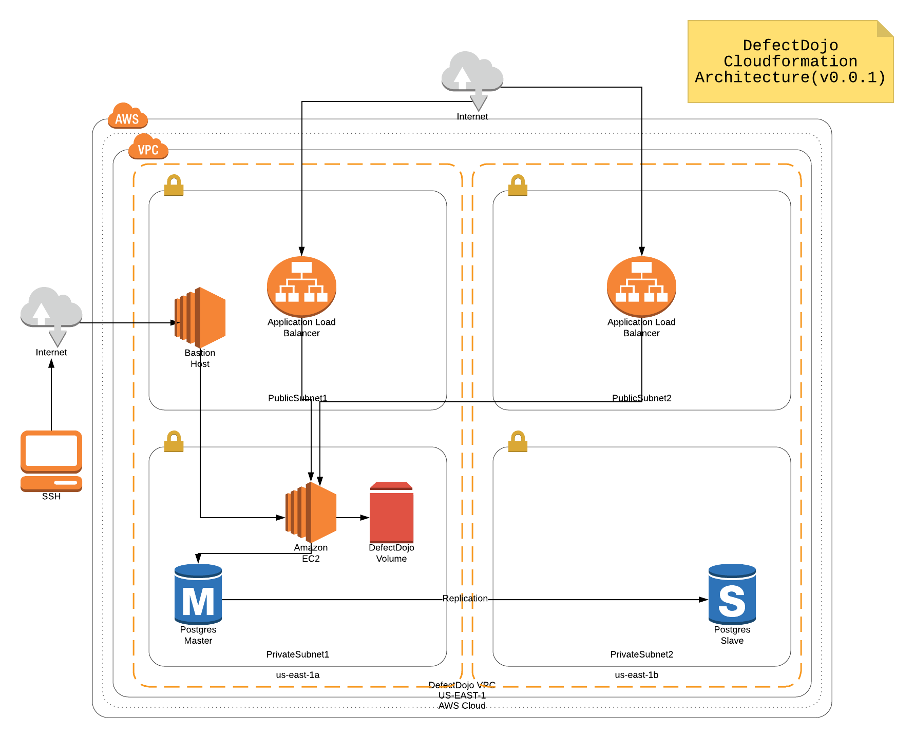
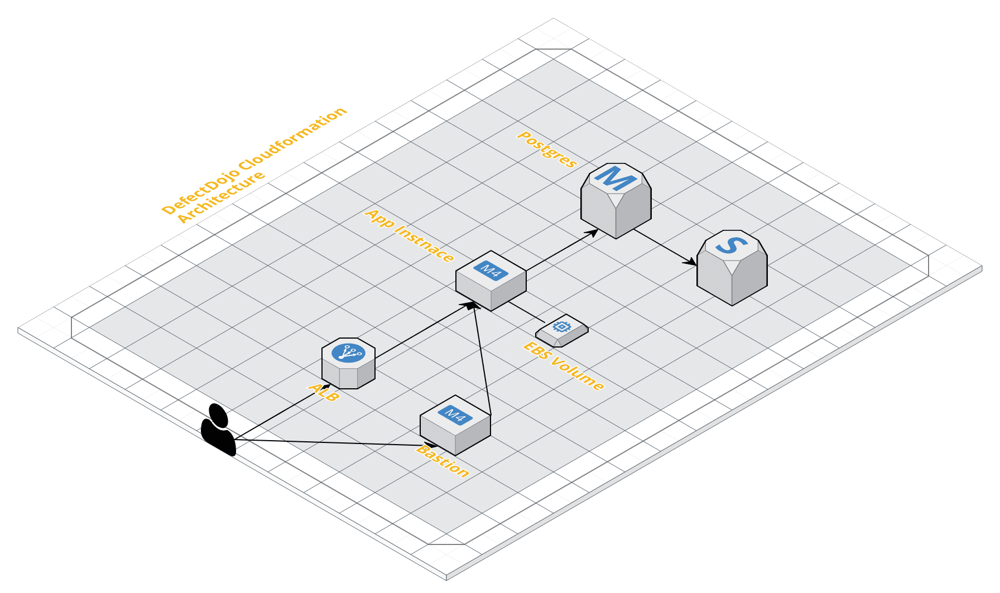

# DefectDojo CloudFormation Setup

### Resources Created
 * VPC
 * Security groups( Bastion, ELB, App, DB)
 * ALB and Target Group
 * Postgres RDS Instance
 * Bastion Instance
 * DefectDojo App Instance
 * DefectDojo EBS Volume

### Prerequisites :-
* Ubuntu AMI ID 'ami-068ab34816099a0a9' needs to be subscribed. Please subscribe to this AMI. Any other Ubuntu 16.04 can also be used.

### Architecture, Flow diagrams

### Steps

1) Create S3 Bucket.
2) Clone the repo.
3) Upload following files to S3 bucket.
  * defectdojo_vpc.yml
  * defectdojo_securitygroups.yml
  * defectdojo_db.yml
  * defectdojo_ec2.yml
4) copy 'dev_sample.json' to 'dev.json'.
5) Modify below values in 'dev.json'.
  * TemplateURLPath :- Example https://s3.amazonaws.com/test_bucket/. Following urls must be accessible.
    * https://s3.amazonaws.com/test_bucket/defectdojo_vpc.yml
    * https://s3.amazonaws.com/test_bucket/defectdojo_securitygroups.yml
    * https://s3.amazonaws.com/test_bucket/defectdojo_db.yml
    * https://s3.amazonaws.com/test_bucket/defectdojo_ec2.yml
  * ApplicationName :- defectdojo
  * RDSDBName :- defectdojo
  * RDSMasterUsername :- defectdojoadmin
  * RDSMasterUserPassword :-
  * ALBSSLCertificateARN :- ALB SSL certificate ARN(AWS CLI :- aws iam list-server-certificates)
  * KeyName :- TestKey (SSH Key Name to log into Bastion, App Instances)
  * AccessAllowedHost1 :- XX.XX.XX.XX/32 (Host which can access DefectDojo app url, ALB, Bastion Host).
  * AppEBSVolumeMountPoint :- /defectdojo
  * DefectDojoBatchModeAdminUser :-
  * DefectDojoBatchModeAdminPassword :-
 6) Create the DefectDojo Stack :-

 aws cloudformation create-stack --stack-name defectdojo --template-body file://defectdojo.yml --parameters file://dev.json --disable-rollback

 Note :- Make sure user executing this command has access to VPC, EC2, RDS services.

7) Track the status of stack creation from AWS Console. Takes appx 7-10 minutes.
8) Once stack status is 'CREATE_COMPLETE', access DefectDojo app by fetching DefectDojo url from 'DefectDojoAppURL' from stack outputs tab.
9) Login into the DefectDojo app with credentials(DefectDojoBatchModeAdminUser,DefectDojoBatchModeAdminPassword) defined in 'dev.json'

### Limitations ###
* This cloudformation had been tested on 'Ubuntu 16.04'(AMI ID :- ami-068ab34816099a0a9)
* This setup is depended on my 'batch_mode' automation PR request, which is currently submitted to 'dev' branch 'https://github.com/DefectDojo/django-DefectDojo/tree/dev'. So currently 'DefectDojoRepoBranch' variable value is set to 'dev'.
